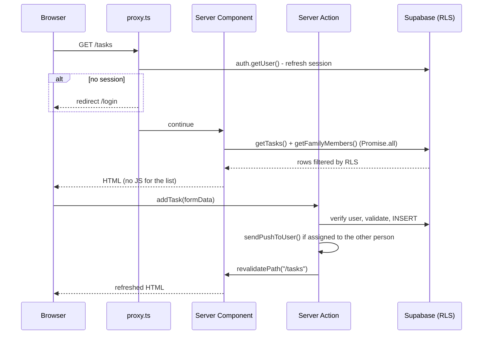
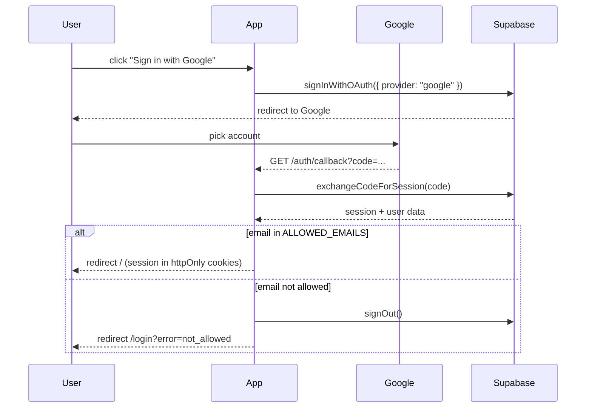
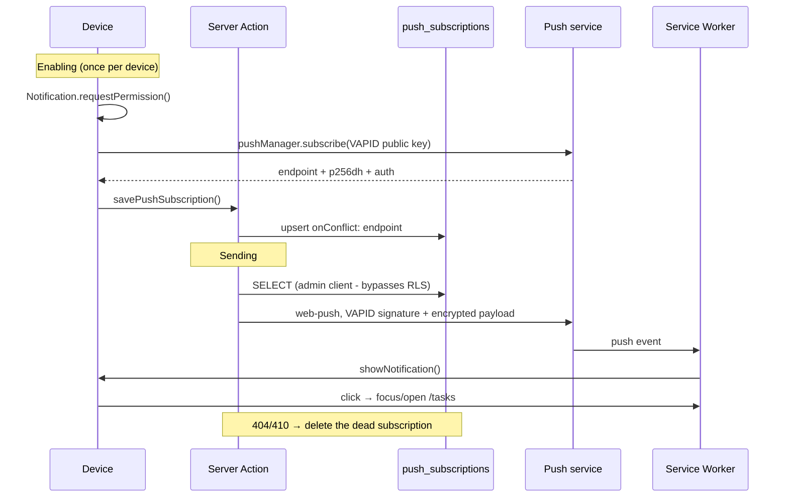
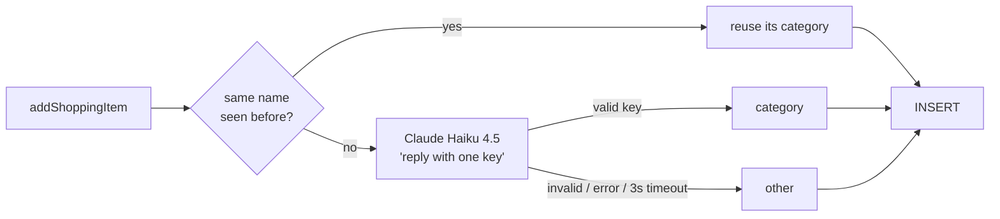

> Production-ready personal PWA built with modern Next.js practices.  
> Demonstrates planning, architecture decisions, Server Components, RLS, and real push notifications - not a tutorial demo.

# Family App

https://family-app-two-eosin.vercel.app (private/Google allowlist)

A private PWA for shared daily tasks and a shopping list, built for **exactly two users** (me and my wife). No public registration, no onboarding, no settings nobody touches.

The guiding principle for the whole project: **simplicity matters more than feature count.** Every decision below is measured against that.

---

## Contents

- [Planning](#planning) - why this set of decisions
- [Tech stack](#tech-stack) - what and why
- [Architecture](#architecture) - how data flows
- [Data model](#data-model)
- [Auth](#auth) - Google OAuth + allowlist
- [PWA and push notifications](#pwa-and-push-notifications)
- [AI shopping-list grouping](#ai-shopping-list-grouping)
- [Execution](#execution) - timeline and status
- [Running locally](#running-locally)
- [Deployment](#deployment)
- [Known limitations](#known-limitations)

---

## Planning

### Constraints that shaped everything else

| Constraint | Consequence in the architecture |
|---|---|
| Exactly 2 users, both trusted | No organizations, teams, invite flows, or roles. Data is **not** partitioned per user - only an "assigned to" field. |
| Solo development, limited time | Managed services instead of self-run infrastructure. Zero DevOps. |
| Must work on mobile | Mobile-first UI, PWA instead of a native app (no app stores, no second codebase). |
| Deployment is routine from day one | Vercel + auto-deploy from `master`. Never "we'll deploy at the end". |
| No formal test suite for the MVP | Instead of tests: TypeScript strict, explicit `ActionResult` types, manual testing. Tests come in when the logic grows. |

### Key decisions and rationale

**Why Next.js App Router, not an SPA + separate backend**
Server Components mean 90% of the app ships no client JavaScript. Server Actions remove an entire layer of REST endpoints - a mutation is a function the component calls directly, and authorization runs on the server where it belongs. For a two-user app that's the fewest moving parts.

**Why Supabase, not self-hosted Postgres + auth**
One service covers the database, authentication, Row Level Security, and (later) real-time. The alternative would be Postgres + NextAuth + hosting + migrations - several times the work for an identical result.

**Why Server Actions instead of API routes**
Less code, types flow from the database to the component without a hand-written `fetch`/`JSON.parse` layer, and there is no URL for anyone to guess. The one exception is `app/auth/callback/route.ts` - an OAuth redirect **must** be a real HTTP route.

**Why a PWA, not React Native**
"Add to Home Screen" gives an icon on the home screen, standalone display, and push notifications - practically everything needed. The cost is zero: same codebase, same deployment.

**Why Google login, not passwords**
No password management, no reset-password flow, no risk of leaked hashes. Both users already have a Google account.

**Why Tailwind, not CSS modules**
Styling stays in the component you're looking at. No second file, no inventing class names, no dead CSS.

---

## Tech stack

| Layer | Technology | Version | Role |
|---|---|---|---|
| Framework | [Next.js](https://nextjs.org) (App Router) | `16.2.11` | Rendering, routing, Server Actions, proxy |
| UI | [React](https://react.dev) | `19.2.4` | Server + Client Components |
| Language | [TypeScript](https://www.typescriptlang.org) | `^5` | `strict: true`, no `any` |
| Styling | [Tailwind CSS](https://tailwindcss.com) | `^4` | CSS-first config (`@theme inline`), no `tailwind.config.js` |
| Database | [Supabase](https://supabase.com) Postgres | - | Data + Row Level Security |
| Auth | Supabase Auth (Google OAuth) | - | Session in httpOnly cookies |
| Supabase SDK | `@supabase/ssr` + `@supabase/supabase-js` | `0.12.3` / `2.110.8` | Cookie-aware clients for SSR |
| Push | [`web-push`](https://github.com/web-push-libs/web-push) | `3.6.7` | VAPID signing + payload encryption |
| AI | [`@anthropic-ai/sdk`](https://github.com/anthropics/anthropic-sdk-typescript) (Claude Haiku 4.5) | `^0.128.0` | Assigns shopping items to store departments |
| Fonts | `next/font` (Geist, Geist Mono) | - | Self-hosted, no layout shift |
| Lint | ESLint 9 + `eslint-config-next` | - | Flat config (`eslint.config.mjs`) |
| Hosting | [Vercel](https://vercel.com) | - | Auto-deploy from `master` |
| Packages | npm | - | |

**Deliberately *absent*:**

- **State management** (Redux, Zustand, TanStack Query) - the server is the source of truth and `revalidatePath` is the cache invalidation. Client state is just `useState` for forms and toggles.
- **An ORM** (Prisma, Drizzle) - the Supabase client is enough for four tables; schemas live in the Supabase dashboard.
- **A UI component library** - `shadcn/ui` is planned, but for now every component is hand-written with Tailwind. It goes in once the UI grows enough to earn it.
---

## Architecture

```
family-app/
├── app/
│   ├── layout.tsx              # Root layout: fonts, ToastProvider, SW registration
│   ├── page.tsx                # Home menu (Tasks / Shopping)
│   ├── manifest.ts             # PWA manifest → /manifest.webmanifest
│   ├── globals.css             # Tailwind v4 + CSS variables (light/dark)
│   ├── login/page.tsx          # Google sign-in
│   ├── tasks/page.tsx          # Task list + filters
│   ├── shopping/page.tsx       # Shopping list
│   ├── auth/callback/route.ts  # OAuth code → session + allowlist check
│   └── actions/                # Server Actions - ALL mutations
│       ├── auth.ts             #   sign in / sign out
│       ├── tasks.ts            #   fetch, add, toggle, assign, delete
│       ├── shopping.ts         #   shopping list
│       └── push.ts             #   register / remove subscription
├── components/                 # Presentation (Server where possible, Client where required)
├── lib/
│   ├── supabase/               # Four clients - see table below
│   ├── auth.ts                 # getCurrentUser(), cache()-d per request
│   ├── family.ts               # getFamilyMembers(), isValidAssignee()
│   ├── types.ts                # ActionResult, Task, ShoppingItem, FamilyMember
│   ├── push.ts                 # sendPushToUser() - VAPID + web-push
│   ├── priority.ts             # priority 1/2/3 → label and color
│   ├── shoppingCategories.ts   # store departments in walking order
│   ├── categorizeItem.ts       # name cache → Claude Haiku → fallback "other"
│   └── helperFunctions.ts      # date formatting
├── public/sw.js                # Hand-written service worker
└── proxy.ts                    # Next.js 16 middleware (session refresh + route protection)
```

### Four Supabase clients - and why they differ

This is the most important part of the architecture to understand. Same SDK, four contexts:

| File | Key | Identity | Used in |
|---|---|---|---|
| `lib/supabase/server.ts` | `anon` | signed-in user (from cookie) | Server Components, Server Actions - **the main path** |
| `lib/supabase/middleware.ts` | `anon` | signed-in user | `proxy.ts`, refreshing session cookies |
| `lib/supabase/client.ts` | `anon` | signed-in user | browser (`"use client"`) - prepared for Realtime, currently unused |
| `lib/supabase/admin.ts` | `service_role` | **nobody** - bypasses RLS | exclusively `lib/push.ts` |

RLS on every table means the `anon` client sees exactly what the policies allow. `admin.ts` exists only because sending a notification **by definition** crosses a user boundary: when I assign a task to my wife, my Server Action has to read *her* push subscriptions, and a `user_id = auth.uid()` policy blocks that.

> ⚠️ `SUPABASE_SERVICE_ROLE_KEY` has full authority over the database. It must never get a `NEXT_PUBLIC_` prefix and must never be imported from a `"use client"` component. See [Known limitations](#known-limitations).

### The path of one request



### Code conventions

- **Server Components by default**; `"use client"` only where interactivity is required (`AddTaskForm`, `TaskItem`, `NotificationsToggle`, `Toast`).
- **Named exports** - `export const`. Default exports only where Next.js demands them (pages, layouts).
- **Arrow function expressions** (`const f = () => {}`) throughout; `function` declarations only for Next.js pages and route handlers.
- **Every mutation returns `ActionResult`** (`{ ok: true } | { ok: false, error: string }`) - errors are never silently swallowed, the UI surfaces them through a toast.
- **React's `cache()`** on `getCurrentUser` and `getFamilyMembers` - if both the page and `UserBar` call the same thing in one render, the query hits the database once.
- **`Promise.all`** for independent fetches (`app/tasks/page.tsx:16`) - no serial waterfalls.
- Comments are in English; UI copy is in Croatian.

---

## Data model

Four tables, all with Row Level Security enabled.

**`tasks`** - a shared list; both users see and modify everything
| Column | Type | Note |
|---|---|---|
| `id` | uuid | PK |
| `title` | text | required |
| `description` | text? | |
| `done` | boolean | |
| `created_by` | uuid? | → `auth.users` |
| `assigned_to` | uuid? | `null` = unassigned |
| `due_date` | date? | |
| `priority` | int | 1 = high, 2 = medium (default), 3 = low |
| `created_at` / `updated_at` | timestamptz | |

**`profiles`** - one row per user, created on first sign-in
`id` (= `auth.users.id`), `email`, `user_name`, `created_at`

**`shopping_items`** - shared shopping list
`id`, `name`, `note?`, `category` (department key, default `'other'`), `done`, `created_by?`, `checked_by?`, `checked_at?`, `created_at`, `updated_at`

**`push_subscriptions`** - one row per **device**, not per user
`id`, `user_id`, `endpoint` (unique), `p256dh`, `auth`

The TypeScript types mirroring these tables live in `lib/types.ts` and are hand-written (no codegen from the schema - not worth it for four tables).

### Task ordering

Defined in `getTasks()` (`app/actions/tasks.ts:36`) - all in a single query, no sorting in JS:

1. open before done (`done ASC`)
2. nearest due date first, no due date last (`due_date ASC NULLS LAST`)
3. higher priority first (`priority ASC`)
4. newest first (`created_at DESC`)

---

## Auth

Passwordless Google OAuth. The anon key and project URL ship in the browser bundle, so anyone can talk to Supabase Auth and PostgREST directly, without going through this app. Access control therefore lives **in the database**, with the app-level check on top:

1. **RLS gate** - a restrictive `family_only` policy (command `ALL`, roles `anon` + `authenticated`) on every table: `(select auth.uid()) in ('<uuid-1>'::uuid, '<uuid-2>'::uuid)`. Restrictive policies are ANDed with the permissive ones, so even a valid JWT for any other account reads and writes nothing. The two user ids are set in the dashboard only, never in the repo.
2. Supabase dashboard: *Allow new users to sign up* = **off**, Email provider **off**.
3. `ALLOWED_EMAILS` check in `app/auth/callback/route.ts` - only guards the app's own login flow; it exists to show a friendly `not_allowed` error, not to protect data.

A new table gets the same `family_only` policy, or it is open to every Supabase account.



The session lives in httpOnly cookies (unreachable from JavaScript). `proxy.ts` refreshes it on every request via `updateSession()` and simultaneously protects every route except `/login` and `/auth/callback`.

> **Note on Next.js 16:** `middleware.ts` was renamed to **`proxy.ts`**, and the exported function to `proxy()`. If you're reading older documentation, the filename differs.

---

## PWA and push notifications

### PWA

- `app/manifest.ts` generates `/manifest.webmanifest` through Next.js `MetadataRoute.Manifest` (typed, no hand-written JSON)
- Icons: 192, 512, and maskable 512 + `apple-touch-icon.png`
- `appleWebApp` metadata in `layout.tsx` - without it iOS won't render standalone mode
- `public/sw.js` - a hand-written service worker, not generated:
  - **network-first** for same-origin GETs → fresh data with a cache fallback when offline
  - Supabase calls and POST mutations are **never** cached
  - `skipWaiting()` + `clients.claim()` → a new deployment takes control immediately

### Push



Design decisions:

- **`sendPushToUser` never throws.** A notification is best-effort - if the push service doesn't respond, adding the task must still succeed. Errors are logged, not propagated.
- **The `await` is nonetheless required** (`app/actions/tasks.ts:91`) - without it the Vercel serverless function exits before the push goes out.
- **No self-notification** - guarded by `assignedTo !== user.id`.
- **Self-cleaning** - `404`/`410` means the subscription no longer exists (the user turned notifications off or removed the app) → the row is deleted.
- **Permission is requested on click only**, never automatically on load. A browser requirement, especially on iOS.

> **iOS:** Web push works **only** if the app is installed to the home screen. In a regular Safari tab it doesn't exist - no error, just silence.

---

## AI shopping-list grouping

The shopping list is silently ordered by store department (produce → bakery → meat → dairy → … → household), so walking through the store means reading the list top to bottom. The UI shows no headings or category labels. The list looks the same as before, only the order changes. Checked items stay newest first.

**The AI classifies an item once; it never re-sorts the list.** When an item is added, `categorizeItem()` assigns it a department key, which is stored in `shopping_items.category`. Sorting is then plain code: the order of `SHOPPING_CATEGORIES` in `lib/shoppingCategories.ts` *is* the walking order.



Design decisions:

- **Classify on write, not on read.** Opening the list never calls the AI, so it stays fast, free, and stable. It can't reshuffle because the model answered differently this time.
- **Name cache before the model.** Repeat purchases (mlijeko, kruh) are the common case. The previous row with the same name (case-insensitive) supplies the category, so most adds make no API call at all.
- **Never blocks an add.** A 3 s timeout, no retries, output validated against the known keys; anything unexpected becomes `other`. A missing `ANTHROPIC_API_KEY` just disables the feature.
- **Smallest model that does the job.** Haiku with `max_tokens: 10`. For two people the cost rounds to zero.
- **Reordering the store is a one-line change.** Unknown or retired keys sort last rather than breaking the page.

---

## Execution

Development went incrementally: every step is a self-contained, deployed feature, not a half-finished branch. Timeline from the git history:

| # | Step | Commit |
|---|---|---|
| 0 | Next.js skeleton + CLAUDE.md context | `1b3cb48`, `c8c4bc2` |
| 1 | Project skill packs (Next.js, React, Supabase, shadcn, design) | `e971da3` |
| 2 | Google auth + basic task operations | `ffc59af` |
| 3 | Restrict sign-in to an email allowlist | `4c15167` |
| 4 | Assignment, priority, due date | `127992e` |
| 5 | PWA manifest + icons + service worker | `32e90c1`, `19ffc18` |
| 6 | Shopping list | `d8ac990` |
| 7 | Push notifications (VAPID, subscriptions, SW handlers) | `068d34f` |

### Roadmap status

- [x] **MVP** - add a task, list tasks, mark as done
- [x] **Due date and assignment** - `due_date`, `assigned_to`, priority 1–3
- [x] **PWA** - install to mobile, offline app shell
- [x] **Shopping list** - a second feature (outside the original roadmap, but the same shape)
- [x] **Push notifications** - planned for "later", shipped early
- [x] **AI shopping-list grouping** - items silently ordered by store department (Claude Haiku)
- [ ] **Real-time sync** - `lib/supabase/client.ts` is prepared, but the Supabase Realtime subscription isn't written yet. Refreshing currently goes through `revalidatePath` after a mutation: the other user's change shows up on navigation, not instantly.
- [ ] **Categories** (house, groceries, kids…)

### Definition of done

A feature is done when:

1. `npm run build` passes with no errors
2. `npm run lint` passes with no errors
3. it's been manually tested in the browser and, where it makes sense, on mobile
4. it's deployed to Vercel

---

## Running locally

**Requirements:** Node.js 20+, npm, a Supabase project, Google OAuth credentials.

```bash
npm install
cp .env.example .env.local   # then fill in the values (see the table below)
npm run dev                  # http://localhost:3000
```

### Environment variables

Values **never** go into git - locally in `.env.local`, in production in the Vercel dashboard.

| Variable | Visibility | Purpose |
|---|---|---|
| `NEXT_PUBLIC_SUPABASE_URL` | public | Supabase project URL |
| `NEXT_PUBLIC_SUPABASE_ANON_KEY` | public | Client key - RLS constrains it |
| `ALLOWED_EMAILS` | **server** | Comma-separated allowed Google emails |
| `NEXT_PUBLIC_VAPID_PUBLIC_KEY` | public | Identifies the server to the push service |
| `VAPID_PRIVATE_KEY` | **server** | Signs push requests |
| `SUPABASE_SERVICE_ROLE_KEY` | **server** | Bypasses RLS - see the warning above |
| `ANTHROPIC_API_KEY` | **server** | Shopping-item categorization; optional - without it new items just sort last |

Next.js inlines **only** variables with the `NEXT_PUBLIC_` prefix into the browser bundle. That prefix is the single thing keeping the `service_role` key out of the client - it isn't cosmetic.

The VAPID pair is generated once:

```bash
npx web-push generate-vapid-keys
```

### Commands

| Command | What it does |
|---|---|
| `npm run dev` | Dev server |
| `npm run build` | Production build (must pass before pushing) |
| `npm run start` | Run the production build locally |
| `npm run lint` | ESLint |

### Testing push locally

Service workers and push require a secure context. `localhost` counts as secure, so `npm run dev` works on desktop. For mobile testing you need an HTTPS tunnel (e.g. `ngrok`) or a Vercel preview deployment.

---

## Deployment

Vercel, auto-deploy from `master`. Every push is a deployment.

For first-time setup:

1. Import the repo into Vercel (Next.js is detected automatically)
2. All environment variables from the table above under *Project Settings → Environment Variables*
3. The Google OAuth redirect URI in the Supabase Auth settings must point at the production domain

**Git workflow:** solo development directly on `master`, small and frequent commits. The rule: **don't push until `npm run build` passes.**

---

## Known limitations

Deliberate trade-offs and things awaiting a fix:

**Realtime isn't implemented.** Roadmap step 3. State currently refreshes through `revalidatePath` after a mutation, which means the other user's change appears on navigation rather than instantly. `lib/supabase/client.ts` exists for exactly this purpose and has no consumer yet.

**`admin.ts` could probably be removed.** The `service_role` key exists only because the `push_subscriptions` policy is per-user. In an app with two trusted users who already share all data, a `to authenticated using (true)` policy for `SELECT`/`DELETE` on that table would make the admin client unnecessary - and remove the most dangerous key from the system. `INSERT`/`UPDATE` would stay strict (`user_id = auth.uid()`).

**No `server-only` guard.** Nothing mechanically prevents `lib/supabase/admin.ts` from ending up in the client bundle - it's protected only by the convention that `lib/push.ts` is its sole caller. A single `import "server-only"` would turn that into a build-time guarantee.

**`pushsubscriptionchange` isn't handled.** When the browser revokes a subscription on its own, the row stays dead in the database until a send returns 404/410. In the meantime the user believes notifications are working.

**Database schemas aren't in the repo.** Tables and RLS policies live in the Supabase dashboard; there are no version-controlled SQL migrations. Acceptable for a two-user app, but it means the schema can't be recreated from code.

**No automated tests.** A conscious MVP decision (see CLAUDE.md). They come in when the logic grows past the point where manual testing suffices.
